# PRD: Gentleman AI Installer

> **One command. Any agent. Any OS. The Gentleman AI ecosystem — configured and ready.**

**Version**: 0.1.0-draft
**Author**: Gentleman Programming
**Date**: 2026-02-27
**Status**: Draft

---

## 1. Problem Statement

AI-assisted development in 2026 is no longer optional — it's the standard. Every developer uses at least one AI coding agent. But here's the real problem:

**Installing an AI agent is the EASY part. Making it ACTUALLY useful is where everyone fails.**

A raw AI agent out of the box is like a sports car with no tuning — it runs, but it's nowhere near its potential. To get real value you need:

1. **Persistent memory** (Engram) — so the agent remembers decisions, bugs, and conventions across sessions
2. **MCP servers** (Context7, Notion, Jira, etc.) — so the agent can access real documentation and project management tools
3. **Coding skills** — curated best-practice patterns for React 19, Next.js 15, TypeScript, Tailwind 4, Zod 4, testing, etc.
4. **SDD workflow** (Spec-Driven Development) — so the agent plans before coding, not the other way around
5. **Proper permissions & security** — block `.env` access, require confirmation on destructive git operations
6. **A persona that teaches, not just completes** — an agent that pushes back on bad practices and explains the WHY
7. All of this configured DIFFERENTLY for each agent (Claude Code, OpenCode, Cursor, VSCode, Gemini CLI, etc.) because each has its own config format, paths, and plugin systems

Most developers either:
- Use their AI agent with default config (10% of its potential)
- Spend DAYS manually configuring one agent, then can't replicate it on another machine or tool
- Never set up memory, MCP, or skills because the setup is fragmented across 5 different repos

**This installer eliminates that gap entirely.** You pick your agent(s), you pick your config level, and the entire Gentleman AI ecosystem gets injected into your tools — ready to go. From zero to championship-level AI development in minutes.

---

## 2. Vision

**The Gentleman AI ecosystem — installable by anyone, on any agent, on any OS, in one command.**

This is NOT an "AI agent installer." Most agents are already easy to install (`npm i -g @anthropic-ai/claude-code`, `brew install opencode`, etc.). This is an **ecosystem configurator**: it takes whatever AI agent(s) you use and supercharges them with the Gentleman stack:

- **Engram** — persistent cross-session memory
- **SDD** — Spec-Driven Development workflow (plan before you code)
- **Skills** — curated coding patterns for modern stacks
- **MCP servers** — real documentation, Notion, Jira, and more
- **Persona & config** — security-first permissions, teaching-oriented persona, themes

**Before**: "I installed Claude Code / OpenCode / Cursor / whatever, but it's just a chatbot that writes code."

**After**: `curl -sL get.gentleman.ai/ai | sh` → Pick your agent(s) → Pick your config → Your agent now has memory, skills, workflow, MCP tools, and a persona that actually teaches you. Same ecosystem regardless of which tool you use.

---

## 3. Target Users

### Primary
- **Professional developers** who want to adopt AI tools seriously, not just play with them
- **Teams** that need a standardized AI development setup across members
- **Developers switching machines** who need to reproduce their AI environment quickly

### Secondary
- **Students** learning to code with AI assistance
- **DevOps/Platform engineers** automating AI tool provisioning for teams
- **Open source contributors** who want a consistent AI-assisted workflow

---

## 4. Supported Platforms

| Platform | Package Manager | Priority |
|----------|----------------|----------|
| macOS (Apple Silicon) | Homebrew | P0 |
| macOS (Intel) | Homebrew | P0 |
| Linux - Ubuntu/Debian | apt + Homebrew | P0 |
| Linux - Arch | pacman | P0 |
| Linux - Fedora/RHEL | dnf | P1 |
| WSL 2 (Windows) | apt + Homebrew | P1 |
| Windows (native) | winget / scoop / choco | P2 |
| Termux (Android) | pkg | P2 |

---

## 5. Prerequisites & Dependency Management

The installer MUST handle installing all prerequisites automatically. A user on a **clean machine** should be able to run the installer and have everything work — no manual `brew install node` beforehand.

### 5.0.1 Dependency Resolution Strategy

The installer follows a **dependency-first** approach:

1. **Detect** what's already installed and at what version
2. **Calculate** what's needed based on the user's component selections
3. **Show** the full dependency tree BEFORE installing anything
4. **Install** dependencies first, then ecosystem components
5. **Verify** each dependency after installation

```
┌──────────────────────────────────────────────────────────────────┐
│  DEPENDENCY TREE (shown to user before install)                  │
│                                                                  │
│  Base tools:                                                     │
│    ✓ git (already installed: 2.43.0)                             │
│    ✓ curl (already installed)                                    │
│    ✓ bash (already installed: 5.2)                               │
│    ◌ Homebrew (will install)                                     │
│                                                                  │
│  Runtimes (needed by selected agents):                           │
│    ◌ Node.js 20 (needed by: Claude Code, Gemini CLI)            │
│    ✓ Go 1.25 (already installed — not needed for binary installs)│
│                                                                  │
│  AI Agents:                                                      │
│    ◌ Claude Code (via npm)                                       │
│    ◌ OpenCode (native binary)                                    │
│                                                                  │
│  Ecosystem:                                                      │
│    ◌ Engram (via Homebrew — no runtime deps)                     │
│    ◌ GGA (via Homebrew — needs bash + git + provider CLI)        │
│    ◌ SDD skills (file copy — no deps)                            │
│    ◌ Skills library (file copy — no deps)                        │
└──────────────────────────────────────────────────────────────────┘
```

### 5.0.2 System-Level Dependencies

These are the base tools the installer itself and the ecosystem need.

#### Always Required

| Dependency | Min Version | Why | Install Method |
|-----------|-------------|-----|----------------|
| `bash` | 3.2+ | GGA, install scripts, Engram plugin hooks | Pre-installed on all targets |
| `git` | 2.x | GGA (diff/staging), Engram (git sync), skills clone, agent integrations | `brew`/`apt`/`pacman`/`dnf`/`pkg` |
| `curl` | Any | Binary downloads, GGA providers (lmstudio, github), installer script | Pre-installed on most systems |

#### Conditionally Required (based on user's selections)

| Dependency | Min Version | When Needed | Install Method |
|-----------|-------------|-------------|----------------|
| **Homebrew** | Any | macOS (primary pkg manager), Linux (recommended for Engram, agents) | Official install script |
| **Node.js** | 20+ | Claude Code (needs 18+), Gemini CLI (needs 20+) — installer picks the highest required version | `brew install node` / `nvm` / `fnm` / distro package |
| **npm** | Comes with Node.js | Installing Claude Code, Gemini CLI, Codex | Bundled with Node.js |
| **Go** | 1.25+ | ONLY if building Engram from source (NOT needed for binary/Homebrew install) | `brew install go` / distro package |
| **python3** | 3.x | GGA with Ollama API mode or LM Studio provider (has fallback without it) | Pre-installed on macOS, `apt`/`pacman`/`dnf` on Linux |
| **gh** (GitHub CLI) | Any | GGA with `github:<model>` provider | `brew install gh` / distro package |

#### Platform-Specific Notes

| Platform | Pre-installed | Needs Installation | Special Handling |
|----------|--------------|-------------------|------------------|
| **macOS** | bash 3.2, curl, shasum, python3 | Homebrew (if not present), Node.js, git (via Xcode CLT) | `xcode-select --install` for git; `shasum` (not `sha256sum`); BSD `sed -i ''` |
| **Ubuntu/Debian** | bash, curl, git, sha256sum | Homebrew (optional), Node.js (apt version is often outdated → use NodeSource or fnm) | Node.js from apt is often v12/v16 — MUST use NodeSource repo or version manager for v20+ |
| **Arch** | bash, curl, git, python3, sha256sum | Node.js (`pacman -S nodejs npm`) | Arch packages are usually current — `pacman` versions are fine |
| **Fedora/RHEL** | bash, curl, git, sha256sum | Node.js (`dnf install nodejs`) | May need `dnf module enable nodejs:20` for correct version |
| **WSL 2** | Same as host Linux distro | Same as Linux + note about Windows-side agents (Cursor, VSCode) | Windows-side agents use Windows paths; WSL agents use Linux paths |
| **Windows native** | None guaranteed | Everything: git (Git for Windows), Node.js (winget/scoop), bash (Git Bash) | GGA needs bash — Git for Windows includes Git Bash |
| **Termux** | bash, curl, git | Node.js (`pkg install nodejs`), python (`pkg install python`) | No sudo, no Homebrew. Commands run directly, not via `sh -c`. Go cross-compile has limitations on Android. |

### 5.0.3 Node.js Version Management

Node.js is the most critical dependency — multiple agents depend on it, and distro-packaged versions are often outdated.

**Strategy:**

| Scenario | Action |
|----------|--------|
| Node.js 20+ already installed | Use it. Do nothing. |
| Node.js installed but < 20 | Warn the user. Offer to install 20+ alongside (via fnm/nvm) or upgrade. |
| Node.js not installed at all | Install via Homebrew (`brew install node@20`) on macOS, or via fnm/NodeSource on Linux |
| `fnm` or `nvm` detected | Use the existing version manager to install/activate v20+ |

**Requirements:**
- R-DEP-01: The installer MUST detect all required dependencies and their versions BEFORE starting installation
- R-DEP-02: The installer MUST show the complete dependency tree to the user and get confirmation before installing anything
- R-DEP-03: The installer MUST install missing dependencies automatically (with user consent) using the platform's preferred package manager
- R-DEP-04: The installer MUST handle Node.js version requirements intelligently — Claude Code needs 18+, Gemini CLI needs 20+, so install 20+ to satisfy both
- R-DEP-05: The installer MUST NOT install Go unless the user explicitly chooses to build Engram from source (pre-compiled binaries are the default)
- R-DEP-06: On Linux, the installer MUST NOT use distro-default Node.js if it's below v20 — use NodeSource, fnm, or Homebrew instead
- R-DEP-07: The installer MUST handle platform-specific differences transparently (BSD sed vs GNU sed, sha256sum vs shasum, Xcode CLT on macOS)
- R-DEP-08: The installer MUST detect existing version managers (fnm, nvm, n) and use them instead of installing Node.js system-wide
- R-DEP-09: If a dependency installation fails, the installer MUST show a clear error with manual installation instructions
- R-DEP-10: The installer MUST NOT require root/sudo for dependency installation except when absolutely necessary (e.g., `apt install`), and MUST explain why when it does
- R-DEP-11: Homebrew MUST be offered as an option on macOS, NOT forced. On Linux, the installer SHOULD prefer native package managers (pacman, dnf) where appropriate, falling back to Homebrew only when native packages are unavailable or outdated

### 5.0.4 Component → Dependency Matrix

| Component | bash | git | curl | Node.js | Homebrew | python3 | gh CLI |
|-----------|------|-----|------|---------|----------|---------|--------|
| **Engram** (binary) | — | — | ✓ (download) | — | ✓ (preferred) | — | — |
| **GGA** | ✓ | ✓ | ◌ (some providers) | — | ✓ (preferred) | ◌ (some providers) | ◌ (github provider) |
| **Claude Code** | ✓ (hooks) | ✓ | — | ✓ (20+) | ◌ | — | — |
| **OpenCode** | — | — | ✓ (download) | — | — | — | — |
| **Gemini CLI** | — | — | — | ✓ (20+) | ◌ | — | — |
| **Codex** | — | — | — | ✓ (18+) | — | — | — |
| **SDD Skills** | ✓ (install script) | ✓ (clone) | — | — | — | — | — |
| **Coding Skills** | — | ✓ (clone) | — | — | — | — | — |

✓ = required, ◌ = optional/conditional, — = not needed

---

## 6. Components to Install & Configure

### 6.1 AI Coding Agents

The installer supports configuring the Gentleman ecosystem into ANY AI coding agent. The user selects which ones they use (or want to use). **The primary job is CONFIGURATION, not installation** — most agents have their own install methods. The installer CAN install agents that are missing, but the core value is injecting the ecosystem.

#### Terminal-Based Agents (CLI)

| Agent | Config Location | Ecosystem Support | Priority |
|-------|-----------------|-------------------|----------|
| Claude Code (Anthropic) | `~/.claude/` | Full: plugins, skills, MCP, CLAUDE.md, settings, hooks, theme, statusline | P0 |
| OpenCode | `~/.config/opencode/` | Full: plugins, skills, MCP, agents, commands, theme | P0 |
| Gemini CLI (Google) | `~/.gemini/` | Partial: MCP, system instructions, skills via system.md | P1 |
| Codex (OpenAI) | `~/.codex/` | Partial: MCP, instructions, config.toml | P1 |
| Aider | `~/.aider/` or `.aider.conf.yml` | Partial: conventions via config, limited MCP | P2 |

#### IDE-Based Agents

| Agent | Config Location | Ecosystem Support | Priority |
|-------|-----------------|-------------------|----------|
| Cursor | `~/.cursor/` | Good: skills via .cursorrules, MCP | P1 |
| VSCode + Copilot/Cline | `~/.vscode/` + extension settings | Partial: skills via workspace rules, MCP via extensions | P1 |
| Windsurf (Codeium) | `~/.windsurf/` or similar | Partial: rules, MCP | P2 |
| Xcode + AI extensions | Xcode config paths | Minimal: persona via project rules | P2 |
| JetBrains + AI Assistant | IDE config paths | Partial: rules, MCP via plugins | P2 |
| Antigravity | TBD (emerging agent) | TBD — implement via Agent interface when stable | P2 |
| Zed + AI | `~/.config/zed/` | Partial: assistant rules, MCP | P2 |

#### Ecosystem Support Tiers

| Tier | What Gets Configured | Agents |
|------|---------------------|--------|
| **Full** | Engram plugin + MCP servers + skills + SDD orchestrator + GGA integration + persona + theme + permissions + statusline + hooks | Claude Code, OpenCode |
| **Good** | Skills + MCP servers + SDD (inline mode, no sub-agents) + GGA as review provider + persona rules | Cursor, VSCode |
| **Partial** | Skills via system instructions + MCP where supported + GGA provider config + persona | Gemini CLI, Codex, Windsurf, JetBrains, Zed |
| **Minimal** | Persona and coding conventions via project/workspace rules | Xcode, Antigravity, any emerging agent |

> **Note:** GGA (Guardian Angel) is agent-agnostic — it works with ANY provider for review execution, independent of which AI coding agent the user chose. It's a cross-cutting concern, not tied to a specific agent tier.

**Requirements:**
- R-AGENT-01: The installer MUST detect already-installed agents and offer configuration only (not re-install)
- R-AGENT-02: The installer MUST support configuring multiple agents in a single session
- R-AGENT-03: The installer MUST NOT require the user to provide API keys during installation (keys are configured separately by the user)
- R-AGENT-04: The installer MUST detect the user's existing agent configurations and offer to preserve, merge, or replace them
- R-AGENT-05: The installer MUST clearly show the "Ecosystem Support Tier" for each agent so users understand what they're getting
- R-AGENT-06: For agents the user doesn't have installed, the installer SHOULD offer to install them (with a clear note about what's being installed)
- R-AGENT-07: The installer architecture MUST allow adding new agents by implementing a single interface — no changes to TUI or core logic required
- R-AGENT-08: The installer MUST be forward-compatible: when new AI agents emerge, a community contributor can add support by implementing the Agent interface and submitting a PR

### 6.2 Engram (Persistent Memory System)

| Component | Method | Notes |
|-----------|--------|-------|
| Engram binary | Go install / Homebrew / direct download | Single binary, no deps |
| Engram plugin for Claude Code | `claude plugin marketplace add` | Automatic |
| Engram plugin for OpenCode | Copy `engram.ts` to plugins dir | Automatic |
| Engram config for Gemini CLI | Write `~/.gemini/settings.json` + `system.md` | Automatic |
| Engram config for Codex | Write `~/.codex/config.toml` entries | Automatic |

**Requirements:**
- R-ENGRAM-01: Engram MUST be installed as a prerequisite for any agent that supports it
- R-ENGRAM-02: The installer MUST configure Engram integration for EVERY selected agent automatically
- R-ENGRAM-03: The installer MUST verify Engram is running (health check on port 7437) after installation
- R-ENGRAM-04: The installer SHOULD configure Engram to start automatically on system boot (launchd on macOS, systemd on Linux)
- R-ENGRAM-05: If Engram is already installed, the installer MUST check the version and offer to upgrade

### 6.3 SDD (Spec-Driven Development) Skills

The full SDD Agent Team skill set (9 skills):

| Skill | Purpose |
|-------|---------|
| sdd-init | Bootstrap SDD context in a project |
| sdd-explore | Investigate ideas before committing |
| sdd-propose | Create change proposals |
| sdd-spec | Write specifications with requirements |
| sdd-design | Technical design documents |
| sdd-tasks | Break down into implementation tasks |
| sdd-apply | Implement code following specs |
| sdd-verify | Validate implementation matches specs |
| sdd-archive | Archive completed changes |

**Requirements:**
- R-SDD-01: SDD skills MUST be installed to the correct path for each selected agent (Claude Code: `~/.claude/skills/`, OpenCode: `~/.config/opencode/skill/`, Cursor: `~/.cursor/skills/`)
- R-SDD-02: The SDD orchestrator configuration MUST be injected into the agent's global config (CLAUDE.md, opencode.json agents, .cursorrules)
- R-SDD-03: OpenCode slash commands (`/sdd-init`, `/sdd-new`, etc.) MUST be installed when OpenCode is selected
- R-SDD-04: The installer MUST pull SDD skills from the latest release of `Gentleman-Programming/sdd-agent-team`

### 6.4 GGA — Gentleman Guardian Angel (AI Code Review)

GGA is a zero-dependency, pure Bash CLI tool that performs **AI-powered code review on every git commit**. It acts as a pre-commit git hook: staged files are sent to any AI provider, validated against team coding standards (defined in `AGENTS.md`), and the commit is allowed or blocked based on the AI's verdict.

**This is the quality gate of the ecosystem.** While skills teach the agent HOW to write code, and SDD ensures the agent PLANS before coding, GGA ensures the code that gets committed actually meets standards — even code the developer wrote manually.

| Component | What It Does |
|-----------|-------------|
| `gga` binary | Pure Bash CLI, installs via Homebrew or direct download |
| Git hook | Pre-commit or commit-msg hook that runs `gga run` |
| `AGENTS.md` rules file | Team coding standards the AI validates against — single source of truth |
| Smart cache | SHA256-based, two-level invalidation (metadata + file content). Only `PASSED` files are cached. |
| PR mode | `gga run --pr-mode` reviews all changed files in a branch vs base |
| CI mode | `gga run --ci` for pipeline integration |

#### Supported AI Providers (for review execution)

| Provider | Config Value | Mechanism |
|----------|-------------|-----------|
| Claude Code | `claude` | Pipes prompt to `claude --print` |
| Gemini CLI | `gemini` | `gemini -p` CLI |
| Codex | `codex` | `codex exec` |
| OpenCode | `opencode[:model]` | `opencode run` |
| Ollama (local) | `ollama:<model>` | REST API or CLI fallback |
| LM Studio (local) | `lmstudio[:model]` | OpenAI-compatible REST API |
| GitHub Models | `github:<model>` | Azure-hosted API via `gh auth` |

**Requirements:**
- R-GGA-01: The installer MUST offer GGA installation as an ecosystem component (opt-in, not forced)
- R-GGA-02: When GGA is selected, the installer MUST install the `gga` binary to the system PATH (via Homebrew or direct download)
- R-GGA-03: The installer MUST ask which AI provider to configure for GGA reviews and write the appropriate `.gga` config
- R-GGA-04: The installer SHOULD offer to install the git hook globally (`git config --global core.hooksPath`) or explain per-project setup via `gga install`
- R-GGA-05: The installer MUST NOT configure GGA's provider with API keys — only the provider name. Keys are managed separately by the user.
- R-GGA-06: The installer SHOULD create a starter `AGENTS.md` template in the user's home directory with common coding standards, or link to examples
- R-GGA-07: If the user selected an AI agent (e.g., Claude Code) AND GGA, the installer SHOULD auto-configure GGA to use that same provider (e.g., `GGA_PROVIDER=claude`)

### 6.5 MCP Servers

| MCP Server | Transport | Purpose | Priority |
|------------|-----------|---------|----------|
| Context7 | Remote HTTP | Up-to-date library documentation | P0 |
| Notion | Remote HTTP | Project management integration | P1 |
| Jira/Atlassian | Remote HTTP | Issue tracking integration | P1 |
| Custom (user-defined) | Varies | User's own MCP servers | P2 |

**Requirements:**
- R-MCP-01: The installer MUST configure selected MCP servers in each agent's MCP config
- R-MCP-02: Context7 MUST be installed by default for all agents (it requires no auth)
- R-MCP-03: For authenticated MCP servers (Notion, Jira), the installer MUST inform the user that auth tokens need to be configured separately, and provide the exact config path and documentation link
- R-MCP-04: The installer MUST NOT store or request API keys, tokens, or credentials

### 6.6 Coding Skills Library

Beyond SDD, additional coding skills that encode best practices:

| Skill Category | Skills | Priority |
|----------------|--------|----------|
| Frontend | react-19, nextjs-15, tailwind-4, zustand-5 | P1 |
| TypeScript | typescript (strict patterns) | P0 |
| Validation | zod-4 | P1 |
| AI SDK | ai-sdk-5 (Vercel AI) | P1 |
| Backend | django-drf | P2 |
| Testing | playwright, pytest, go-testing | P1 |
| API/Claude | claude-developer-platform | P0 |
| Workflow | pr-review, skill-creator, homebrew-release | P2 |

**Requirements:**
- R-SKILLS-01: The installer MUST present skills in categories and allow the user to select which categories/individual skills to install
- R-SKILLS-02: Skills MUST be installed to all selected agents simultaneously
- R-SKILLS-03: The installer MUST support a "Full Stack" preset that installs all P0 + P1 skills
- R-SKILLS-04: The installer MUST support a "Minimal" preset with only P0 skills (TypeScript + claude-developer-platform)
- R-SKILLS-05: Skills SHOULD be pulled from a central repository or registry, not embedded in the binary
- R-SKILLS-06: The installer MUST configure agent global instructions (CLAUDE.md, opencode agents) to auto-detect and load skills based on file context

### 6.7 Agent Configuration (Persona, Theme, Permissions)

#### Persona Selection — "Your own Gentleman!"

The Gentleman persona is the heart of this ecosystem, but it's **100% optional**. The user chooses their experience:

| Persona Option | Description | What it Configures |
|---------------|-------------|-------------------|
| **Gentleman Mode** | "Your own Gentleman!" — The Senior Architect mentor who teaches, challenges, and pushes you to understand concepts before code. Rioplatense Spanish for Spanish input, direct English otherwise. Uses Tony Stark/Jarvis analogies. | Full persona in CLAUDE.md / opencode agents / .cursorrules, custom thinking verbs, teaching-first behavior |
| **Neutral Mode** | Professional, helpful, no personality overlay. The agent stays with its default behavior. | Security permissions only, no persona injection |
| **Custom Persona** | Bring your own! User provides a persona description or selects from community presets. | User-provided text injected into agent instructions |

#### Other Configuration Aspects

| Config Aspect | What Gets Configured |
|---------------|---------------------|
| Theme | Gentleman dark theme (navy/steel/gold) or default |
| Permissions | Security-first defaults: deny .env, ask on destructive git ops, allow standard tools |
| Editor mode | vim / emacs / default |
| Statusline | Custom statusline with model info, git status, context usage (Claude Code) |
| Thinking verbs | Custom spinner text — Rioplatense phrases like "Tomando un Cafecito mientras Pienso" (only with Gentleman persona) |
| Keybindings | Vim-style or default |

**Requirements:**
- R-CONFIG-01: The persona selection MUST be a first-class step in the installation flow, presented clearly with personality descriptions
- R-CONFIG-02: Selecting "Gentleman Mode" MUST display the tagline "Your own Gentleman!" and a brief preview of how the agent will behave
- R-CONFIG-03: The installer MUST offer a "Custom" mode where the user can pick individual config aspects
- R-CONFIG-04: Permission defaults MUST follow the security-first model: block .env access, require confirmation for destructive git operations — REGARDLESS of persona choice (security is not optional)
- R-CONFIG-05: The installer MUST NOT overwrite existing agent configurations without explicit user consent
- R-CONFIG-06: The installer SHOULD offer to backup existing configs before making changes (same pattern as Gentleman.Dots)
- R-CONFIG-07: Thinking verbs and Rioplatense expressions MUST only be configured when Gentleman persona is selected
- R-CONFIG-08: The installer SHOULD support community-contributed personas in the future (out of scope for v1, but architecture must allow it)

---

## 7. User Experience

### 7.1 Installation Flow

```
curl -sL get.gentleman.ai/ai | sh
                  │
                  ▼
     ┌─────────────────────┐
     │   Download binary    │
     │   (detect OS/arch)   │
     └──────────┬──────────┘
                │
                ▼
     ┌─────────────────────────────────┐
     │   TUI: Welcome                   │
     │   "Gentleman AI Ecosystem"       │
     │   Supercharge your AI agents.    │
     └──────────┬──────────────────────┘
                │
                ▼
     ┌─────────────────────────────────┐
     │  System Scan                     │
     │  Detected: Claude Code ✓         │
     │            OpenCode ✓            │
     │            Cursor ✗              │
     │            Engram ✗              │
     │  OS: macOS (Apple Silicon)       │
     └──────────┬──────────────────────┘
                │
                ▼
     ┌─────────────────────────────────┐
     │  Select AI Agents                │  ← Shows detected (pre-checked) + available
     │  ☑ Claude Code (installed)       │
     │  ☑ OpenCode (installed)          │
     │  ☐ Gemini CLI                    │
     │  ☐ Cursor                        │
     │  ☐ VSCode (Copilot/Cline)       │
     │  ...                             │
     └──────────┬──────────────────────┘
                │
                ▼
     ┌─────────────────────────────────┐
     │  Choose your Persona             │
     │                                  │
     │  ★ "Your own Gentleman!"         │  ← Senior Architect mentor, teaches,
     │     The mentor who pushes you     │     challenges, Rioplatense Spanish
     │     to understand before coding.  │
     │                                  │
     │  ○ Neutral                       │  ← No persona, default agent behavior
     │  ○ Custom                        │  ← Bring your own persona text
     └──────────┬──────────────────────┘
                │
                ▼
     ┌─────────────────────────────────┐
     │  Select Ecosystem Preset         │
     │                                  │
     │  ★ Full Gentleman                │  ← Everything: Engram + SDD + Skills
     │     (Engram + SDD + All Skills   │     + MCP + Theme + Permissions
     │      + MCP + Theme)              │
     │                                  │
     │  ○ Ecosystem Only                │  ← Tools without persona
     │  ○ Minimal                       │  ← Just Engram + basics
     │  ○ Custom                        │  ← Pick each component
     └──────────┬──────────────────────┘
                │
        ┌───────┴───────┐
        │ If "Custom":  │
        │               ▼
        │  ┌──────────────────────┐
        │  │ ☑ Engram (memory)    │
        │  │ ☑ SDD (workflow)     │
        │  │ ☑ GGA (code review)  │
        │  │ Select Skills...     │
        │  │ Select MCP servers...│
        │  │ Select Theme...      │
        │  └────────┬─────────────┘
        │           │
        └───────┬───┘
                │
                ▼
     ┌─────────────────────────────────┐
     │  Review & Confirm                │
     │                                  │
     │  Agents: Claude Code, OpenCode   │
     │  Persona: Gentleman              │
     │  Memory: Engram ✓                │
     │  Workflow: SDD (9 skills) ✓      │
     │  Code Review: GGA (claude) ✓     │
     │  Coding Skills: 15 skills ✓      │
     │  MCP: Context7, Notion ✓         │
     │  Theme: Gentleman Dark ✓         │
     │                                  │
     │  [Install]  [Back]               │
     └──────────┬──────────────────────┘
                │
                ▼
     ┌─────────────────────────────────┐
     │  Configuring...                  │
     │                                  │
     │  ✓ Installing Engram             │
     │  ✓ Installing GGA               │
     │  ✓ Configuring Claude Code       │
     │    ✓ Skills (22 files)           │
     │    ✓ MCP servers                 │
     │    ✓ Engram plugin               │
     │    ✓ Permissions & theme         │
     │  ✓ Configuring GGA (claude)      │
     │  ◌ Configuring OpenCode...       │
     │    [████████░░] 80%              │
     └──────────┬──────────────────────┘
                │
                ▼
     ┌─────────────────────────────────┐
     │  Done! Your AI agents are ready. │
     │                                  │
     │  Next steps:                     │
     │  1. Set API keys (see below)     │
     │  2. Try: claude "hello"          │
     │  3. Try: /sdd-new my-feature     │
     │                                  │
     │  Agents configured: 2            │
     │  Skills installed: 22            │
     │  Memory: Engram running ✓        │
     └─────────────────────────────────┘
```

### 7.2 Non-Interactive Mode

For CI, automation, and team provisioning:

```bash
gentle-ai install \
  --agents claude-code,opencode \
  --preset gentleman \
  --skills full-stack \
  --mcp context7,notion \
  --non-interactive
```

**Requirements:**
- R-UX-01: The installer MUST support both interactive TUI and non-interactive CLI modes
- R-UX-02: The TUI MUST use the Bubbletea framework with Lipgloss styling (consistent with Gentleman.Dots)
- R-UX-03: Installation progress MUST stream real-time logs to the TUI
- R-UX-04: The installer MUST show a summary of all changes before applying them
- R-UX-05: The installer MUST show clear "Next Steps" after completion (API key setup, first commands to try)
- R-UX-06: The TUI MUST support vim-style navigation (j/k, Enter, Esc)
- R-UX-07: Every step that modifies the system MUST be reversible (backup + restore)

### 7.3 Screens

| Screen | Purpose |
|--------|---------|
| Welcome | Branding, version, what this tool does |
| System Detection | Show detected OS, existing tools, existing configs, installed dependencies |
| Agent Selection | Multi-select AI agents to install/configure |
| Persona Selection | "Your own Gentleman!" / Neutral / Custom |
| Preset Selection | Full Gentleman / Ecosystem Only / Minimal / Custom |
| MCP Server Selection | Which MCP integrations to enable (Custom mode) |
| Skills Selection | Which coding skills to install (Custom mode) |
| Config Customization | Theme, permissions, editor mode (Custom mode) |
| Dependency Tree | Full list of what needs to be installed (deps + agents + ecosystem) with user confirmation |
| Review | Final summary of everything that will be installed/configured |
| Installing | Real-time progress: dependencies first, then agents, then ecosystem configuration |
| Complete | Success message, next steps, useful commands |
| Backup Management | List/restore/delete previous config backups |

---

## 8. Technical Architecture

### 8.0 Ecosystem Architecture — How Everything Connects

This section describes how all Gentleman ecosystem components interact with each other, both at **install time** (what the installer does) and at **runtime** (what the developer experiences daily).

#### 8.0.1 The Big Picture

```mermaid
graph TB
    subgraph INSTALLER["🔧 GENTLEMAN AI INSTALLER (one-time setup)"]
        direction TB
        GAI[gentle-ai binary]
        GAI --> DEP_ENGINE[Dependency Engine]
        GAI --> AGENT_ENGINE[Agent Configurator]
        GAI --> ECO_ENGINE[Ecosystem Injector]
    end

    subgraph DEPS["📦 DEPENDENCIES (installed first)"]
        BREW[Homebrew]
        NODE[Node.js 20+]
        GIT[git]
        BASH_DEP[bash]
    end

    subgraph AGENTS["🤖 AI CODING AGENTS (user's choice)"]
        CC[Claude Code]
        OC[OpenCode]
        GEM[Gemini CLI]
        CUR[Cursor]
        VSC[VSCode + Copilot/Cline]
        CDX[Codex]
        OTHER[Other agents...]
    end

    subgraph ECOSYSTEM["⚡ GENTLEMAN ECOSYSTEM (injected into agents)"]
        direction TB
        ENGRAM[🧠 Engram<br/>Persistent Memory]
        SDD[📋 SDD Skills<br/>Spec-Driven Development]
        GGA_COMP[🛡️ GGA<br/>Guardian Angel Code Review]
        SKILLS[📚 Coding Skills<br/>React, TS, Tailwind, etc.]
        MCP[🔌 MCP Servers<br/>Context7, Notion, Jira]
        PERSONA[🎭 Persona & Config<br/>Gentleman / Neutral / Custom]
    end

    subgraph RUNTIME["🏃 DAILY DEVELOPMENT (after install)"]
        DEV[Developer]
    end

    DEP_ENGINE --> DEPS
    AGENT_ENGINE --> AGENTS
    ECO_ENGINE --> ECOSYSTEM

    DEV -->|uses| CC
    DEV -->|uses| OC
    DEV -->|uses| GEM
    DEV -->|commits| GGA_COMP

    CC -->|remembers via| ENGRAM
    OC -->|remembers via| ENGRAM
    GEM -->|remembers via| ENGRAM

    CC -->|follows| SKILLS
    OC -->|follows| SKILLS
    CUR -->|follows| SKILLS

    CC -->|plans with| SDD
    OC -->|plans with| SDD

    CC -->|queries| MCP
    OC -->|queries| MCP
    CUR -->|queries| MCP

    CC -->|behaves as| PERSONA
    OC -->|behaves as| PERSONA

    style INSTALLER fill:#1a1b26,stroke:#E0C15A,color:#E0C15A
    style ECOSYSTEM fill:#1a1b26,stroke:#7FB4CA,color:#7FB4CA
    style AGENTS fill:#1a1b26,stroke:#B7CC85,color:#B7CC85
    style DEPS fill:#1a1b26,stroke:#957FB8,color:#957FB8
    style RUNTIME fill:#1a1b26,stroke:#CB7C94,color:#CB7C94
```



#### 8.0.2 Runtime Component Interaction

This is what happens AFTER installation — the daily developer experience:


#### 8.0.3 Installation Pipeline — Dependency Resolution Order


#### 8.0.4 Agent Configuration Matrix — What Gets Injected Where


#### 8.0.5 Memory & Knowledge Flow — How the Agent Learns Over Time

This diagram shows the continuous learning loop that Engram enables across sessions:

```mermaid
sequenceDiagram
    participant Dev as Developer
    participant Agent as AI Agent<br/>(Claude Code / OpenCode)
    participant Engram as Engram Server<br/>(localhost:7437)
    participant DB as SQLite + FTS5<br/>(~/.engram/engram.db)
    participant MCP as MCP Servers<br/>(Context7, Notion, Jira)
    participant SDD as SDD Workflow
    participant GGA as GGA<br/>(Pre-commit Hook)

    Note over Dev,GGA: === SESSION START ===

    Agent->>Engram: mem_session_start(project)
    Engram->>DB: INSERT session
    Engram-->>Agent: Previous context injected<br/>(recent sessions, decisions, bugs)

    Note over Dev,GGA: === DEVELOPMENT LOOP ===

    Dev->>Agent: "Add auth to the API"
    Agent->>MCP: Query Context7 for JWT docs
    MCP-->>Agent: Latest library documentation
    Agent->>Engram: mem_search("auth patterns")
    Engram->>DB: FTS5 MATCH query
    DB-->>Engram: Past decisions about auth
    Engram-->>Agent: "Last time we used JWT with httpOnly cookies"

    Agent->>SDD: /sdd-new auth-feature
    Note over SDD: explore → propose → spec<br/>→ design → tasks → apply

    Agent->>Dev: Implementation + explanation

    Agent->>Engram: mem_save("JWT auth middleware",<br/>type: decision)
    Engram->>DB: INSERT observation<br/>(with topic_key upsert)

    Note over Dev,GGA: === COMMIT ===

    Dev->>GGA: git commit -m "feat: add auth"
    GGA->>GGA: Read staged files<br/>+ AGENTS.md rules
    GGA->>Agent: Review code against standards
    Agent-->>GGA: STATUS: PASSED ✓
    GGA->>GGA: Cache passed files (SHA256)
    GGA-->>Dev: Commit allowed ✓

    Note over Dev,GGA: === SESSION END ===

    Agent->>Engram: mem_session_summary(goal,<br/>discoveries, accomplished, files)
    Engram->>DB: INSERT summary observation

    Note over Dev,GGA: === NEXT SESSION (days later) ===

    Agent->>Engram: mem_context(project)
    Engram-->>Agent: "Last session: added JWT auth<br/>to src/middleware/auth.ts.<br/>Decision: httpOnly cookies,<br/>refresh token rotation."
    Note over Agent: Agent resumes WITH FULL CONTEXT<br/>as if it never left
```



#### 8.0.6 Cross-Agent Synchronization

When a developer uses multiple agents, the ecosystem keeps them in sync:


**Key architectural principle:** Engram is the **shared brain** across all agents. A decision made in Claude Code is available in OpenCode and Gemini CLI. Skills are identical copies. The developer can switch agents freely without losing context.

#### 8.0.7 Component Ownership & Boundaries


---

### 8.1 Technology Stack

| Layer | Technology | Rationale |
|-------|-----------|-----------|
| Language | Go | Same as Gentleman.Dots + Engram. Single binary, cross-compile, no runtime deps |
| TUI | Bubbletea + Lipgloss | Proven in Gentleman.Dots. Elm architecture, excellent terminal support |
| Distribution | Homebrew tap + direct binary download + curl installer | Same as Gentleman.Dots |
| Skills source | Git clone from repos at install time | Always latest version |
| Config format | JSON, YAML, TOML, Markdown | Match each agent's native format |

### 8.2 Package Structure (Proposed)

```
gentle-ai/
├── cmd/
│   └── gentle-ai/
│       └── main.go                 # CLI entrypoint
├── internal/
│   ├── system/
│   │   ├── detect.go               # OS, arch, WSL, Termux detection
│   │   ├── exec.go                 # Command execution, logging
│   │   └── deps.go                 # Dependency detection, version checks, install logic
│   ├── agents/
│   │   ├── agent.go                # Agent interface
│   │   ├── claude_code.go          # Claude Code install + config
│   │   ├── opencode.go             # OpenCode install + config
│   │   ├── cursor.go               # Cursor install + config
│   │   ├── gemini_cli.go           # Gemini CLI install + config
│   │   ├── codex.go                # Codex install + config
│   │   └── windsurf.go             # Windsurf install + config
│   ├── components/
│   │   ├── engram.go               # Engram install + config per agent
│   │   ├── gga.go                  # GGA install + provider config
│   │   ├── sdd.go                  # SDD skills install + orchestrator config
│   │   ├── mcp.go                  # MCP server configuration per agent
│   │   ├── skills.go               # Skills library install
│   │   └── config.go               # Persona, theme, permissions, etc.
│   ├── presets/
│   │   ├── gentleman.go            # Full Gentleman preset definition
│   │   ├── minimal.go              # Minimal preset definition
│   │   └── preset.go               # Preset interface
│   ├── backup/
│   │   └── backup.go               # Config backup & restore
│   └── tui/
│       ├── model.go                # State model
│       ├── update.go               # Message handling
│       ├── view.go                 # Rendering
│       ├── styles.go               # Lipgloss styles
│       └── screens/
│           ├── welcome.go
│           ├── detection.go
│           ├── agents.go
│           ├── presets.go
│           ├── mcp.go
│           ├── skills.go
│           ├── config.go
│           ├── review.go
│           ├── installing.go
│           ├── complete.go
│           └── backup.go
├── e2e/
│   ├── Dockerfile.*                # Per-OS test containers
│   └── e2e_test.sh
├── scripts/
│   └── install.sh                  # curl-able installer script
├── go.mod
├── go.sum
├── README.md
├── LICENSE
└── .goreleaser.yaml
```

### 8.3 Agent Interface

Every AI agent MUST implement a common interface. Methods return `ErrNotSupported` for capabilities the agent doesn't support (e.g., Xcode can't do MCP). The installer handles this gracefully — it skips unsupported steps and shows the user what WAS configured vs what COULDN'T be.

```go
type Agent interface {
    // Identity
    Name() string
    Tier() SupportTier                     // Full, Good, Partial, Minimal

    // Detection
    Detect() (*DetectionResult, error)     // Is it installed? What version? What config exists?
    Install(ctx context.Context) error     // Install the agent binary (optional — user may already have it)

    // Ecosystem configuration (each returns ErrNotSupported if agent can't do it)
    ConfigureEngram() error                // Set up Engram integration (plugin, MCP, or instructions)
    ConfigureMCP(servers []MCPServer) error // Add MCP server entries
    ConfigureSkills(skills []Skill) error  // Install skill files to correct paths
    ConfigureSDD() error                   // Set up SDD orchestrator + commands/slash-commands
    ConfigurePersona(persona Persona) error // Set up agent persona/instructions
    ConfigureTheme(theme Theme) error      // Apply theme if supported
    ConfigurePermissions(perms Permissions) error // Security defaults

    // Validation
    Verify() error                         // Post-install health check

    // Metadata
    ConfigPaths() []string                 // Paths that will be modified (for backup)
    Capabilities() []Capability            // What this agent supports (for UI display)
}
```

This interface is the **extension point** for community contributions. Adding support for a new AI agent (e.g., Antigravity, a new JetBrains AI, whatever comes next) means implementing this interface — nothing else changes.

### 8.4 Preset System

```go
type Preset struct {
    Name        string
    Description string
    Agents      []AgentID           // Recommended agents
    MCPServers  []MCPServerID       // Which MCP servers to enable
    SkillSets   []SkillSetID        // Which skill categories
    Persona     PersonaConfig       // Persona settings
    Theme       ThemeConfig         // Visual theme
    Permissions PermissionsConfig   // Security model
}
```

**Predefined presets:**

| Preset | What's Included | Persona | Description |
|--------|----------------|---------|-------------|
| `full-gentleman` | All agents detected + Engram + SDD + all skills + MCP + theme | "Your own Gentleman!" | The complete experience. Everything configured, Gentleman persona, dark theme, the works. |
| `ecosystem-only` | Engram + SDD + skills + MCP for selected agents | Neutral (no persona) | All the tools and workflow, zero personality. For developers who want the ecosystem but prefer their agent's default behavior. |
| `minimal` | Engram + basic skills for selected agents | Neutral | Just memory and essential skills. Quick and lean. |
| `custom` | User picks each component | User picks | Full control over every aspect. |

---

## 9. Distribution & Installation

### 9.1 Install Methods

| Method | Command | Priority |
|--------|---------|----------|
| curl (recommended) | `curl -sL get.gentleman.ai/ai \| sh` | P0 |
| Homebrew | `brew install Gentleman-Programming/tap/gentle-ai` | P0 |
| Go install | `go install github.com/Gentleman-Programming/gentle-ai/cmd/gentle-ai@latest` | P1 |
| Direct binary | Download from GitHub Releases | P1 |
| winget (Windows) | `winget install gentle-ai` | P2 |

### 9.2 Cross-Compilation Targets

| Target | GOOS/GOARCH | Notes |
|--------|-------------|-------|
| macOS Apple Silicon | darwin/arm64 | Primary |
| macOS Intel | darwin/amd64 | |
| Linux x86_64 | linux/amd64 | |
| Linux ARM64 | linux/arm64 | Raspberry Pi, cloud instances |
| Linux ARM | linux/arm | |
| Windows x86_64 | windows/amd64 | P2, native support |
| Android ARM64 | android/arm64 | Termux |

### 9.3 Release Automation

- GoReleaser for cross-compilation and release packaging
- GitHub Actions for CI/CD
- Homebrew tap auto-update on new release
- Checksum verification in curl installer script

---

## 10. Update & Maintenance

### 10.1 Self-Update

**Requirements:**
- R-UPDATE-01: The installer MUST support `gentle-ai update` to check for and install newer versions of itself
- R-UPDATE-02: The installer MUST support `gentle-ai update --skills` to pull latest skill versions for all configured agents
- R-UPDATE-03: The installer MUST support `gentle-ai update --engram` to update Engram to the latest version
- R-UPDATE-04: The installer SHOULD check for updates on launch and notify (not auto-update)

### 10.2 Config Sync

**Requirements:**
- R-SYNC-01: The installer MUST keep skills synchronized across all installed agents (one source of truth)
- R-SYNC-02: When updating skills for one agent, the installer MUST update them for all configured agents
- R-SYNC-03: The installer SHOULD support exporting its current configuration as a shareable profile (JSON/YAML)
- R-SYNC-04: The installer SHOULD support importing a team configuration profile

---

## 11. Post-Install Experience

### 11.1 What the User Gets After Installation

When the installer completes with "Full Gentleman" preset + Claude Code + OpenCode:

**Claude Code:**
- `~/.claude/CLAUDE.md` — Gentleman persona with SDD orchestrator
- `~/.claude/settings.json` — Security-first permissions, Gentleman theme, vim mode, custom statusline, thinking verbs
- `~/.claude/skills/` — All selected skills (SDD + coding skills)
- `~/.claude/plugins/` — Engram plugin installed and active
- `~/.claude.json` — Context7 MCP server configured

**OpenCode:**
- `~/.config/opencode/opencode.json` — Agents (gentleman, sdd-orchestrator), MCP servers (engram, context7), Engram plugin, Gentleman theme
- `~/.config/opencode/skill/` — All selected skills mirrored
- `~/.config/opencode/commands/` — SDD slash commands
- `~/.config/opencode/plugins/` — Engram TypeScript plugin

**Engram:**
- `engram` binary in PATH
- Running as background service (port 7437)
- Database initialized at `~/.engram/engram.db`
- Integrated with all selected agents

**GGA (Guardian Angel):**
- `gga` binary in PATH
- Configured with selected AI provider (e.g., `GGA_PROVIDER=claude`)
- Global config at `~/.config/gga/config`
- Ready for per-project setup via `gga install`

**Verification:**
- The installer runs a health check: `engram serve` responds, MCP tools are callable, skills are in correct paths
- Clear output: "You're ready. Run `claude` or `opencode` and start building."

### 11.2 Next Steps Guide

The completion screen MUST show:

1. **Set your API keys** — exact commands/paths for each agent:
   - Claude Code: `export ANTHROPIC_API_KEY=sk-...` (or link to auth docs)
   - OpenCode: auth plugin setup
   - Gemini: `export GEMINI_API_KEY=...`
2. **Try it out** — first command to run per agent
3. **Learn SDD** — brief explanation + link to SDD docs
4. **Join the community** — Discord/YouTube links

---

## 12. Non-Functional Requirements

### 12.1 Performance
- R-PERF-01: Full installation (2 agents + all components) MUST complete in under 5 minutes on a standard broadband connection
- R-PERF-02: The binary MUST be under 15MB
- R-PERF-03: The TUI MUST render at 60fps minimum (smooth animations)

### 12.2 Security
- R-SEC-01: The installer MUST NOT request, store, or transmit API keys or tokens
- R-SEC-02: The curl installer script MUST be verifiable (checksum)
- R-SEC-03: All downloads MUST use HTTPS
- R-SEC-04: The installer MUST NOT require root/sudo except for specific system operations (e.g., `chsh`), and MUST explain WHY when it does
- R-SEC-05: Default agent permissions MUST block access to `.env` files and credentials paths

### 12.3 Reliability
- R-REL-01: Every installation step MUST be idempotent (safe to re-run)
- R-REL-02: If a step fails, the installer MUST continue with remaining steps and report failures at the end
- R-REL-03: The installer MUST support `gentle-ai repair` to re-run failed steps
- R-REL-04: The backup system MUST create timestamped snapshots before any config modification

### 12.4 Extensibility
- R-EXT-01: Adding a new AI agent MUST only require implementing the Agent interface (no changes to TUI or core logic)
- R-EXT-02: Adding a new MCP server MUST only require adding an entry to the MCP registry
- R-EXT-03: Adding a new skill MUST only require adding it to the skills catalog
- R-EXT-04: Presets MUST be declarative (data, not code)

### 12.5 Accessibility
- R-ACC-01: The TUI MUST work in terminals with 80x24 minimum dimensions
- R-ACC-02: The TUI MUST support both mouse and keyboard navigation
- R-ACC-03: The non-interactive mode MUST provide equivalent functionality for screen readers and CI environments

---

## 13. Relationship to Gentleman.Dots

| Aspect | Gentleman.Dots | Gentleman AI Installer |
|--------|---------------|----------------------|
| Purpose | Dev environment (editors, shells, terminals) | AI development layer (agents, memory, skills) |
| What it installs | Neovim, Fish/Zsh/Nushell, Tmux/Zellij, Ghostty/Kitty/etc. | Claude Code, OpenCode, Engram, SDD, MCP servers, skills |
| Overlap | None — complementary tools | None — different layer |
| Can use together | Yes — install Gentleman.Dots first for dev env, then Gentleman AI for AI layer | Same |
| Shared patterns | Go + Bubbletea + Lipgloss, multi-OS detection, backup system | Same architecture, consistent UX |

**Requirements:**
- R-DOTS-01: The installer SHOULD detect if Gentleman.Dots is already installed and acknowledge it ("Great, you already have Gentleman.Dots! This installer adds the AI layer on top.")
- R-DOTS-02: The installer MUST work independently — Gentleman.Dots is NOT a prerequisite
- R-DOTS-03: The two installers SHOULD share the same Gentleman visual identity (theme, branding)

---

## 14. Future Considerations (Out of Scope for v1)

These are NOT requirements for v1 but should inform architectural decisions:

1. **Team profiles** — Shareable config profiles for standardizing AI setup across a team
2. **Plugin marketplace** — Browse and install community-created skills from a central registry
3. **AI agent health dashboard** — TUI screen showing status of all installed agents, Engram memory stats, MCP server connectivity
4. **Auto-detection of project stack** — When entering a project directory, suggest relevant skills to install
5. **Migration tool** — Import settings from one agent to another (e.g., Cursor user switching to Claude Code)
6. **Gentleman.Dots integration** — Combined installer that does BOTH dev environment + AI layer in one flow
7. **Remote provisioning** — SSH-based installation on remote servers/VMs
8. **Nix flake** — Declarative alternative to imperative installation (see Gentleman.Dots2 experiment)

---

## 15. Success Metrics

| Metric | Target |
|--------|--------|
| Time from curl to working AI environment | < 5 minutes |
| Supported OS coverage | macOS + 3 Linux distros + WSL at launch |
| Agent coverage | Claude Code + OpenCode at launch, 2+ more within 3 months |
| Idempotency | 100% — re-running produces same result |
| User needs to manually edit configs after install | 0 files (except API keys) |

---

## 16. Open Questions

1. **Naming**: `gentle-ai`, `gentle-ai`, `gai`, or something else? Should it be part of the `Gentleman-Programming` org or standalone?
2. **Skills registry**: Should skills be embedded in the binary, fetched from GitHub at install time, or pulled from a dedicated registry service?
3. **Windows native**: How much effort to invest in native Windows (not WSL) support for v1? Most AI coding tools have limited Windows support anyway.
4. **Config format**: Should the installer's own config (what was installed, preferences) be stored as JSON, YAML, or TOML? Where?
5. **Gentleman.Dots convergence**: Should this eventually merge with Gentleman.Dots into a single unified installer with two modes (dev env + AI)?
6. **Version pinning**: Should the installer pin specific versions of tools/skills, or always install latest?

---

## Appendix A: Competitive Landscape

| Tool | What it does | Limitation |
|------|-------------|------------|
| `claude` CLI setup | Installs Claude Code only | Single tool, no skills/memory/MCP |
| `opencode` install | Installs OpenCode only | Single tool, manual config |
| `engram setup` | Installs Engram for one agent | Memory only, no skills/agents |
| `sdd-agent-team/install.sh` | Installs SDD skills | Skills only, no agents/memory |
| `gga` install | Installs GGA for one project | Code review only, no ecosystem |
| Various dotfile managers | Stow, chezmoi, etc. | Generic, not AI-specific |

**None of these solve the full problem.** Each handles one piece. This installer orchestrates ALL of them — Engram, SDD, GGA, skills, MCP, persona, theme — into a coherent, working AI development ecosystem across any agent the user chooses.

---

## Appendix B: Example Non-Interactive Commands

```bash
# Full Gentleman preset with Claude Code + OpenCode
gentle-ai install --preset gentleman --agents claude-code,opencode

# Minimal setup, just Claude Code with basic security
gentle-ai install --preset minimal --agents claude-code

# Team provisioning from shared profile
gentle-ai install --profile ./team-ai-config.yaml

# Update all skills to latest
gentle-ai update --skills

# Update Engram
gentle-ai update --engram

# Backup current configs
gentle-ai backup

# Restore from backup
gentle-ai restore --list
gentle-ai restore --id 2026-02-27-143022

# Repair failed installation
gentle-ai repair

# Show what's installed
gentle-ai status
```
